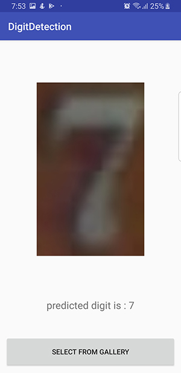
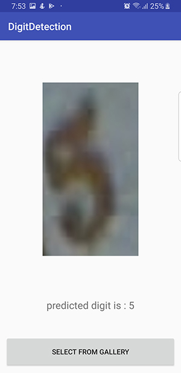
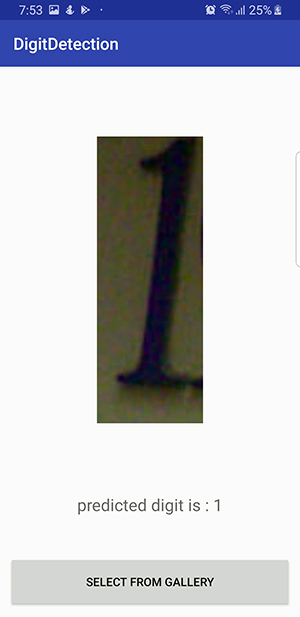

# Deploy Keras model to Android
[](pic/mainflow.png)




There is a guildline to use Keras lib for training your model and deploy the trained model to your android application. For clarifying the flow, we implemented an application by using a popular dataset, SVHN. We want to detect digit in the android app by using Keras model trained. We spilled this problem into two-part (android and python) that we explained each one separately.

## Python
In the python folder, you can see some scripts that you should run them respectively.
One of the most important thing that you have to notice, it is your version of TensorFlow module. Because if you don’t pay that, maybe your final trained model won’t work in your android app. It should be `1.9.0`

`0_extract_svhn_dataset.py`: Will extract cropped svhn dataset. If you want to use your dataset, you should put your data as a separate class (folder) into “data” dir.

`1_train_keras_model.py`: By this script, you can restructure your own model by Keras command. At the end of the process in this step, you will have a trained model generated by Keras lib.

`2_load_keras_model.py`: Before using your model in the main situation, we suggest testing that trained model. This step is not necessary but you can figure out the accuracy of your model and realize is that well-built or no?

`3_convert_keras_to_tensorflow.py`: You can NOT use a model that is trained by using Keras lib, in Android code. So, you need to convert that to .pb format. In this step, you will do it as a piece of cake. You just need to run this script and nothing else.

The model that you will use it in your Android app is provided in the model folder by `custom_tensorflow_model.pb` name. You just pick it up and go to the Android studio. ;)


## Android
You can get a simple application that used a trained model from the android folder. There are some step to use this code.
#### Step1:
First of all, you should implement (compile) TensorFlow lib in your Gradle. As we mentioned before, the version of TensorFlow lib is very important to sync your model in your app. The version of TensorFlow that you should use in the android Gradle is `1.5.0`. The version of TF in android and python gets from different sources; But for syncing, they should set correctly. python: `1.9.0` and android: `1.5.0`.
```sh
implementation 'org.tensorflow:tensorflow-android:1.5.0'
```
```sh
dependencies {
    classpath 'com.android.tools.build:gradle:3.1.4'
    ...
}
```
#### Step2:
You should put your model that is created in python (.pb format) into the assets folder.

#### Step3:
Our issue is a classification type. That means we should map our input (image) to one of the specified classes (digit 0, 1, 2, …, 9). A file by `label_strings.txt` name keeps the name of each class in each line. For example, our SVHN digit detection problem needs 10 labels from 0 to 9 that write in this file. By considering your application, you should change the text of this file.

As you can see in this app, you can select an image from the gallery and feed your model by that. Next, get the result of what the model predicts as an output.
